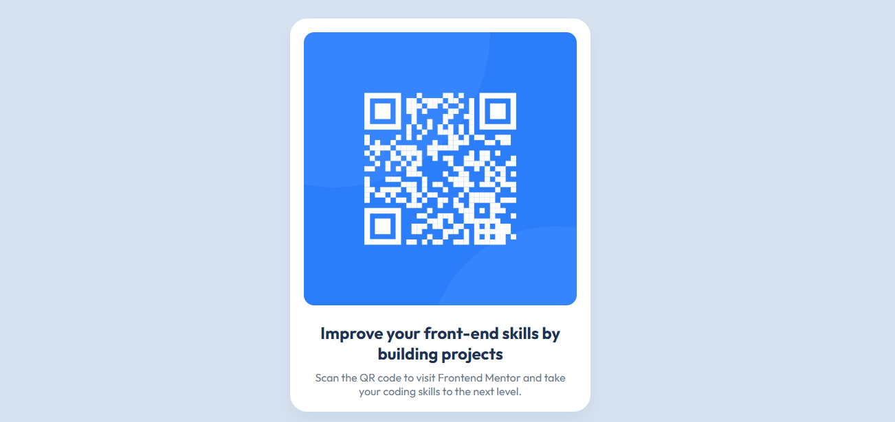

# 📱 QR Code Component

🚀 Projeto desenvolvido como solução de um desafio da plataforma **Frontend Mentor**, com foco em prática de desenvolvimento front-end baseada em cenários reais.

> 💡 A plataforma fornece desafios com designs profissionais, permitindo aplicar conceitos de HTML e CSS na construção de interfaces modernas e responsivas.

---

## 🔗 Desafio original

👉 [https://www.frontendmentor.io/challenges/qr-code-component-iux_sIO_H](https://www.frontendmentor.io/challenges/qr-code-component-iux_sIO_H)

---

## 📸 Preview



---

## 🚀 Sobre o projeto

Este projeto consiste na construção de um componente de QR Code responsivo, seguindo um design fornecido.

🎯 **Objetivo:**

* Praticar HTML semântico
* Aplicar CSS moderno
* Trabalhar organização de código
* Desenvolver atenção a detalhes de layout

---

## 🛠️ Tecnologias utilizadas

* HTML5
* CSS3
* CSS Variables
* Flexbox

---

## 📁 Estrutura do projeto

```bash
qr-code-component/
│── index.html
│── .gitignore
│── src/
│   ├── css/
│   │   ├── reset.css
│   │   ├── variables.css
│   │   └── style.css
│   └── images/
```

---

## 🌐 Deploy


[GitHub-Pages](https://thalitasilva620.github.io/qr-code-component/)

---

## 📚 Aprendizados

Durante o desenvolvimento deste projeto, pratiquei:

* Organização de CSS com separação por responsabilidade
* Uso de variáveis CSS para manutenção escalável
* Estruturação de layout responsivo
* Boas práticas de versionamento com Git

---

## 💡 Melhorias futuras

* ✨ Adicionar animações suaves
* 🌙 Implementar modo escuro
* ♿ Melhorar acessibilidade (a11y)

---

## 👩‍💻 Autor

Feito por **Thalita Silva**

* GitHub: [https://github.com/thalitasilva620](https://github.com/thalitasilva620)

---

## 🏁 Conclusão

Este projeto faz parte da minha jornada de aprendizado em desenvolvimento front-end e representa evolução na construção de interfaces organizadas, responsivas e alinhadas com boas práticas do mercado 💼🚀

